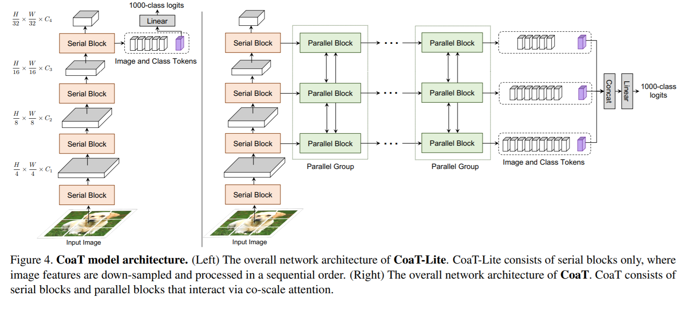

# CoaT: Co-Scale Conv-Attentional Image Transformers
This repo contains PyTorch implementation of paper [Co-Scale Conv-Attentional Image Transformers](https://arxiv.org/abs/2104.06399)
,this repo is not the official implementation. For official implementation please visit [here](https://github.com/mlpc-ucsd/CoaT).




## Usage:
```python
import numpy as np
from coat import CoaT
import torch

img = torch.ones([1, 3, 224, 224])

coatlite = CoaT(3, 224, 1000)
out = coatlite(img)
print("Shape of out :", out.shape)  # [B, num_classes]

parameters = filter(lambda p: p.requires_grad, coatlite.parameters())
parameters = sum([np.prod(p.size()) for p in parameters]) / 1_000_000
print('Trainable Parameters in CoaT-Lite: %.3fM' % parameters)

# use_parallel=True for Parallel Group
coat_tiny = CoaT(3, 224, 1000, out_channels=[152, 152, 152, 152], scales=[4, 4, 4, 4], use_parallel=True) 
out = coat_tiny(img)
print("Shape of out :", out.shape)  # [B, num_classes]

parameters = filter(lambda p: p.requires_grad, coat_tiny.parameters())
parameters = sum([np.prod(p.size()) for p in parameters]) / 1_000_000
print('Trainable Parameters in CoaT Tiny: %.3fM' % parameters)
```
## Citation:
```
@misc{xu2021coscale,
      title={Co-Scale Conv-Attentional Image Transformers}, 
      author={Weijian Xu and Yifan Xu and Tyler Chang and Zhuowen Tu},
      year={2021},
      eprint={2104.06399},
      archivePrefix={arXiv},
      primaryClass={cs.CV}
}
```
